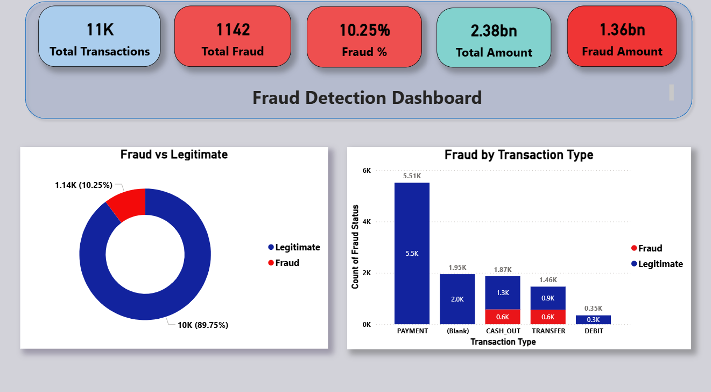
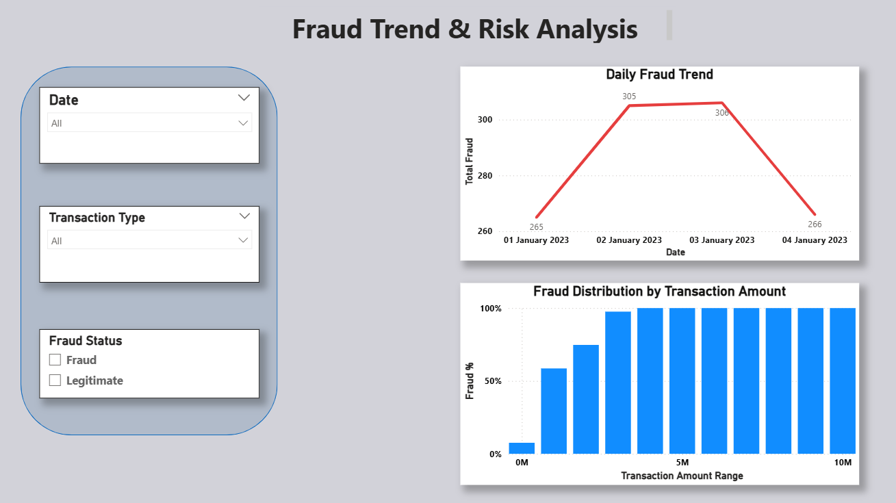

# 💳 FraudShield AI – End-to-End Fraud Detection System


---

## 🚀 Project Overview

**FraudShield AI** is an end-to-end fraud detection system that integrates:

- 🧠 Machine Learning (XGBoost)
- 🌐 Flask Web Application
- 🎨 Premium FinTech Dashboard UI
- 📊 Power BI Business Intelligence Dashboard

The system predicts fraudulent financial transactions and provides:

- Fraud Probability Score (%)
- Risk Classification (Safe / Medium / High)
- Expected Financial Loss Estimation
- Multi-Currency Support (₹ INR / $ USD)
- Business Insights via Power BI

---

# 🧠 Machine Learning Model

- Algorithm: **XGBoost Classifier**
- Model Format: `fraud_model.json`
- Feature Engineering:
  - Balance Difference Features
  - Zero Balance Indicators
  - Transaction Ratio Features
  - One-hot Encoded Transaction Types

---

# 🌐 Flask Web Application

## 🔐 Login Authentication
- Session-based login
- Secure route protection

## 📊 Risk Assessment Dashboard
- Circular dynamic risk meter
- Real-time fraud probability
- Expected financial loss calculation
- Currency selector (INR / USD)
- Premium glassmorphism UI design

---

# 📈 Power BI Business Intelligence Dashboard

The Power BI dashboard provides advanced analytical insights into fraud patterns and financial risk exposure.

### 📊 Dashboard Page 1 – Fraud Overview



---

### 📊 Dashboard Page 2 – Transaction Analysis



---

## 📌 Power BI Insights Included

✔ Fraud vs Non-Fraud Distribution  
✔ Transaction Type Comparison  
✔ Fraud Percentage KPI  
✔ Total Expected Financial Loss  
✔ Risk Trend Analysis  
✔ Interactive Filters & Slicers  

Power BI file included:

```
Fraud_Analytics_Dashboard.pbix
```

# ⚙️ Tech Stack

| Layer | Technology |
|-------|------------|
| ML Model | XGBoost |
| Backend | Flask |
| Data Processing | Pandas |
| Frontend | HTML + CSS |
| BI Dashboard | Power BI |
| Programming | Python |

---

# 📂 Project Structure

```
FraudShield-AI-End-to-End/
│
├── app.py
├── fraud_detection.ipynb
├── requirements.txt
├── Fraud_Analytics_Dashboard.pbix
│
├── templates/
│     ├── index.html
│     └── dashboard.html
│
├── screenshots/
│     ├── login.png
│     ├── dashboard.png
│     └── powerbi_dashboard.png
```

---

# 🔧 Installation & Setup

## 1️⃣ Clone Repository

```bash
git clone https://github.com/your-username/FraudShield-AI-End-to-End.git
cd FraudShield-AI-End-to-End
```

## 2️⃣ Create Virtual Environment

```bash
python -m venv fraud_env
```

Activate:

Windows:
```bash
fraud_env\Scripts\activate
```

Mac/Linux:
```bash
source fraud_env/bin/activate
```

## 3️⃣ Install Dependencies

```bash
pip install -r requirements.txt
```

If requirements file missing:

```bash
pip install flask pandas xgboost
```

## 4️⃣ Run Flask App

```bash
python app.py
```

Open in browser:

```
http://127.0.0.1:5000
```

---

# 🔐 Demo Credentials

```
Username: admin
Password: 1234
```

---

# 📊 Risk Classification Logic

| Probability | Classification |
|-------------|---------------|
| < 40% | Safe |
| 40–70% | Medium Risk |
| > 70% | High Risk |

---

# 📈 Power BI Insights Included

✔ Fraud percentage KPI  
✔ Total transaction volume  
✔ Fraud trend analysis  
✔ Transaction type comparison  
✔ Expected loss summary  
✔ Interactive slicers & filters  

---

# 🚀 Future Enhancements

- Database integration (MySQL / PostgreSQL)
- Live exchange rate API
- REST API version
- Cloud deployment (Render / Azure)
- Role-based authentication
- Real-time streaming fraud detection

---

# 👩‍💻 Author

Developed by **Nighitha T N**    

---

# ⭐ If You Like This Project

Please give it a ⭐ and connect with me!
