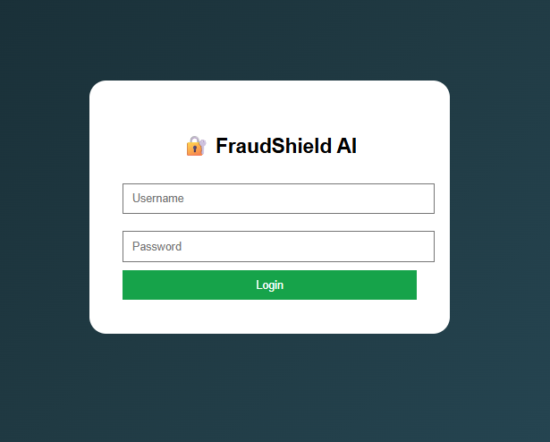
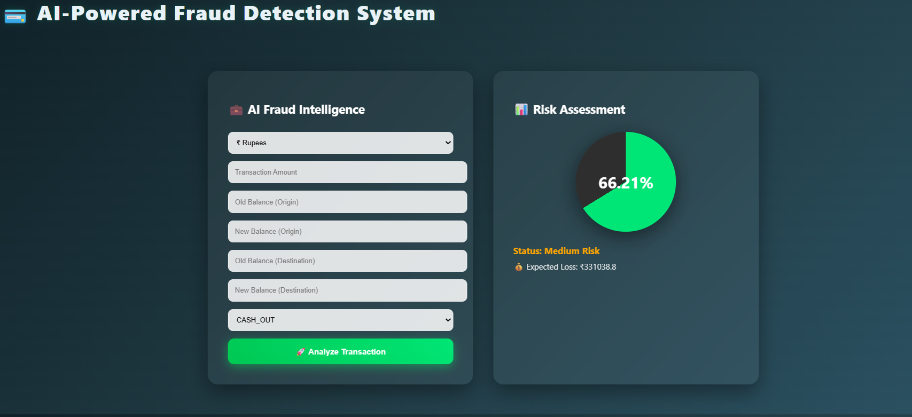

# 💳 FraudShield AI – Intelligent Fraud Detection Dashboard


---

## 🚀 Project Overview

**FraudShield AI** is a machine learning-powered fraud detection web application built using:

- 🧠 XGBoost (Trained ML Model)
- 🌐 Flask (Backend Web Framework)
- 🎨 Premium FinTech UI (Glassmorphism Design)
- 📊 Real-time Risk Scoring Dashboard

The system predicts the probability of a financial transaction being fraudulent and provides:

- Fraud probability (%)
- Risk classification (Safe / Medium / High Risk)
- Expected financial loss estimation
- Currency selection (₹ INR / $ USD)
- Interactive circular risk meter

---

## 🖥️ Dashboard Preview

### 🔐 Login Page


### 📊 Fraud Detection Dashboard


---

## 🧠 Machine Learning Model

- Algorithm: **XGBoost Classifier**
- Saved Model Format: `fraud_model.json`
- Feature Engineering includes:
  - Balance differences
  - Zero balance indicators
  - Transaction ratio features
  - One-hot encoded transaction types

---

## ⚙️ Tech Stack

| Component | Technology |
|-----------|------------|
| Backend | Flask |
| ML Model | XGBoost |
| Data Processing | Pandas |
| Frontend | HTML + CSS (Custom UI) |
| Deployment Ready | Yes |

---

## 📂 Project Structure

```
FraudShield-AI-Flask/
│
├── app.py
├── fraud_model.json
├── requirements.txt
│
├── templates/
│     ├── login.html
│     └── dashboard.html
│
└── screenshots/
      ├── login.png
      └── dashboard.png
```

---

## 🔧 Installation & Setup

### 1️⃣ Clone Repository

```bash
git clone https://github.com/your-username/FraudShield-AI-Flask.git
cd FraudShield-AI-Flask
```

### 2️⃣ Create Virtual Environment

```bash
python -m venv fraud_env
```

Activate:

Windows:
```bash
fraud_env\Scripts\activate
```

Mac/Linux:
```bash
source fraud_env/bin/activate
```

### 3️⃣ Install Dependencies

```bash
pip install -r requirements.txt
```

If requirements file not available:

```bash
pip install flask pandas xgboost
```

### 4️⃣ Run Application

```bash
python app.py
```

Open browser:

```
http://127.0.0.1:5000
```

---

## 🔐 Demo Login Credentials

```
Username: admin
Password: 1234
```

---

## 🎯 Features

✔ AI-powered fraud probability scoring  
✔ Premium FinTech dashboard design  
✔ Circular dynamic risk meter  
✔ Currency selection (INR / USD)  
✔ Expected loss estimation  
✔ Session-based login authentication  
✔ Clean modular Flask structure  

---

## 📊 Risk Classification Logic

| Probability | Classification |
|-------------|---------------|
| < 40% | Safe |
| 40–70% | Medium Risk |
| > 70% | High Risk |

---

## 🚀 Future Improvements

- Real-time currency exchange API
- Transaction history database (SQL)
- User authentication with hashing
- Admin analytics dashboard
- Cloud deployment (Render / Heroku)
- REST API version

---

## 👩‍💻 Author

Developed by **Nighitha TN**   

---

## ⭐ If you like this project

Give it a ⭐ on GitHub and connect with me!

---
